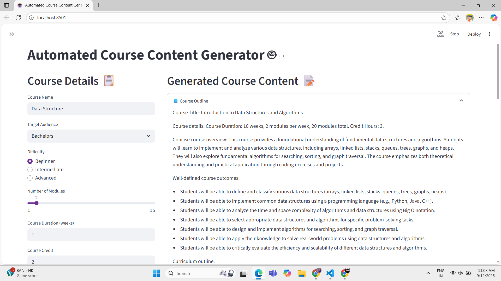

# Automated Course Content Generator 🎓✨

An AI-powered Streamlit app that generates **course outlines, lesson content, and quizzes** from a given topic/article.  
It also allows exporting the generated content into a **PDF file** for easy sharing.

## 📸 Output Screenshots

### 🏠 Homepage


### 📑 Generated Course Outline
)

---

## 🚀 Features
- Generate structured **course outline** 📑  
- Auto-generate **detailed lessons** 📝  
- Create **quizzes for assessment** ❓  
- Export everything into a **downloadable PDF** 📄  
- Powered by **Gemini API**  

---

## 🛠️ Tech Stack
- **Python 3.9+**  
- **Streamlit** for UI  
- **Google Generative AI (Gemini)** for content generation  
- **ReportLab** for PDF export  

---

## ⚡ Installation & Setup

1. Clone the repo:
   ```bash
   git clone https://github.com/yashdhudat/automated-course-generator.git
   cd automated-course-generator
Create and activate a virtual environment:

bash
Copy code
python -m venv venv
source venv/bin/activate   # On Mac/Linux
venv\Scripts\activate      # On Windows
Install dependencies:

bash
Copy code
pip install -r requirements.txt
Run the app:

bash
Copy code
streamlit run app.py
📂 Project Structure
bash
Copy code
automated-course-generator/
│── app.py              # Main Streamlit app
│── config.py           # API configuration
│── requirements.txt    # Dependencies
│── README.md           # Project Documentation
🙌 Acknowledgements
Google Gemini API

Streamlit

👤 Author
Yash Dhudat

LinkedIn: www.linkedin.com/in/yash-dhudat-4a231b249

GitHub: (https://github.com/yashdhudat)
